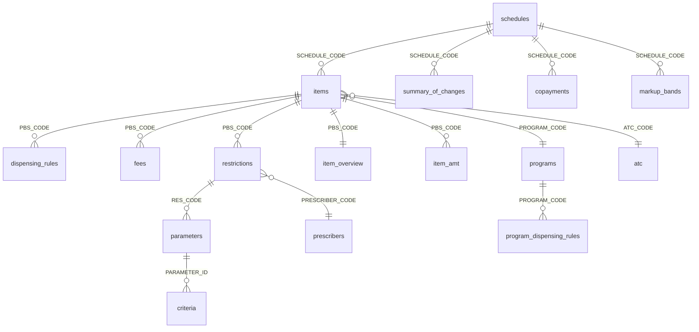

import { Aside } from '@astrojs/starlight/components';

# PBS Data Model

The PBS API exposes a relational data model centered around **items** (pharmaceutical products). Understanding the entity relationships is key to efficient API usage.

## Entity-Relationship Diagram

## Core Entities

### Schedule (Root)

Every query starts with a **schedule**. A schedule represents one month's PBS data, identified by `SCHEDULE_CODE` (e.g., `2026-02-01`). The API retains the current schedule plus the past 12 months.

<Aside type="tip">
Always call `GET /schedules?get_latest_schedule_only=true` first to get the current schedule code. Then pass it as `schedule_code` to every other endpoint.
</Aside>

### Item (Central Entity)

An **item** is a specific pharmaceutical product listing on the PBS: a unique combination of drug, brand, form, strength, and pack size. Items are identified by `PBS_CODE`.

Key fields:
- `PBS_CODE` — unique identifier for this listing
- `DRUG_NAME` / `LI_DRUG_NAME` — active ingredient (uppercase / mixed case)
- `BRAND_NAME` — commercial brand name
- `ITEM_CODE` — alternative item identifier
- `PROGRAM_CODE` — which PBS program this belongs to

### Restriction Hierarchy

Many PBS items have prescribing restrictions. These form a three-level hierarchy:

1. **Restriction** (`restrictions`) — top level, linked to an item via `PBS_CODE`
2. **Parameter** (`parameters`) — grouped conditions within a restriction, linked via `RES_CODE`
3. **Criteria** (`criteria`) — specific requirements, linked via `PARAMETER_ID`

### Reference Data

Small, relatively stable datasets:
- **Programs** — PBS programs (General Schedule, Repatriation, S100)
- **Prescribers** — prescriber type codes
- **Organisations** — organisation type codes
- **Copayments** — patient copayment amounts
- **Markup bands** — wholesale pricing tiers
- **ATC** — WHO therapeutic classification

## Navigation Patterns

| Starting from... | To get... | Use... |
|-----------------|-----------|--------|
| Nothing | Current schedule code | `GET /schedules?get_latest_schedule_only=true` |
| Schedule code | All items | `GET /items?schedule_code={code}` |
| Drug name | Matching items | `GET /items?schedule_code={code}&drug_name={name}` |
| PBS code | Full item detail | `GET /item-overview?schedule_code={code}&pbs_code={code}` |
| PBS code | Restrictions | `GET /restrictions?schedule_code={code}&pbs_code={code}` |
| RES_CODE | Parameters | `GET /parameters?schedule_code={code}&res_code={code}` |
| PARAMETER_ID | Criteria | `GET /criteria?schedule_code={code}&parameter_id={id}` |
